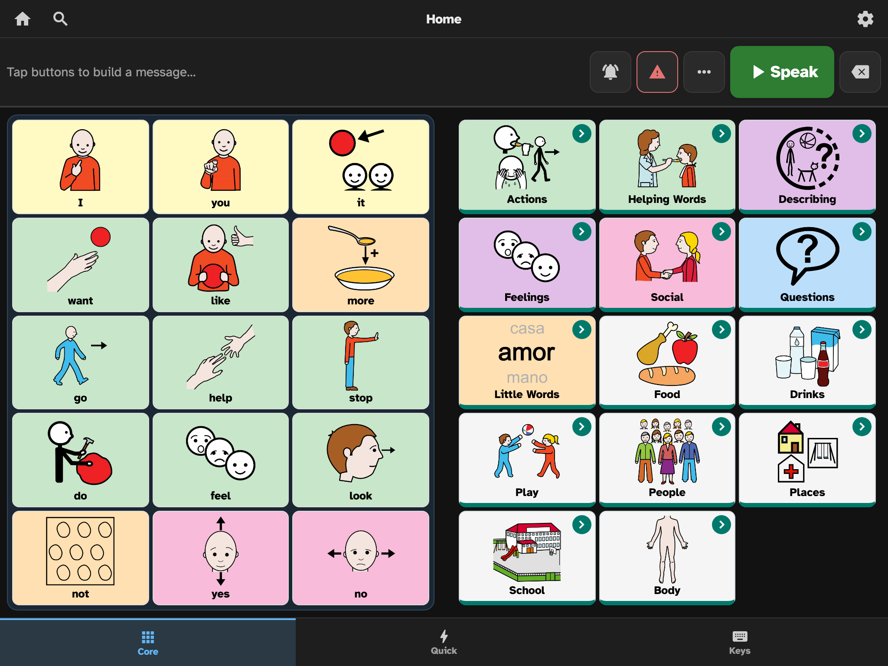
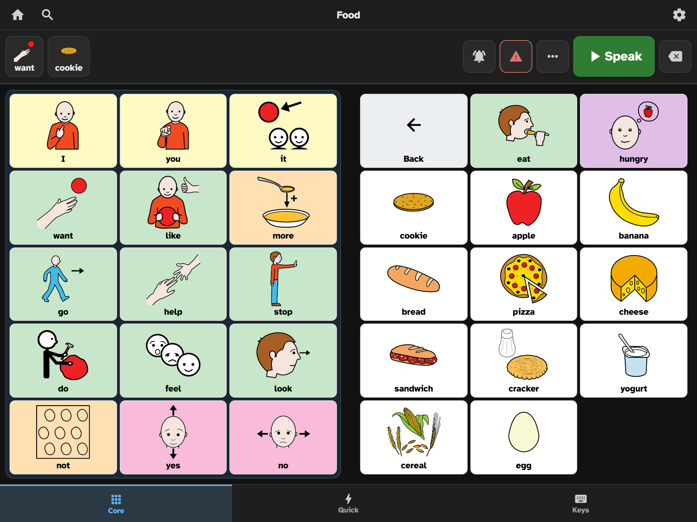

# SayThrough

**A free, open-source communication app — a voice for people who can't rely on speech.**

SayThrough is Augmentative and Alternative Communication (AAC) software: a symbol-and-word grid that speaks aloud, so children and adults who are non-verbal or have limited speech can build sentences and be heard. It's a free alternative to apps like TD Snap ($9.99/month) and Proloquo2Go ($249.99) — built for the teachers, parents, speech-language pathologists (SLPs), and communicators who can't afford, or shouldn't have to pay for, a voice.



## Why it exists

A commercial AAC app can cost more per month than a family's internet bill, or hundreds of dollars up front. For a tool someone needs every single day to communicate, that's a barrier that shouldn't exist. SayThrough is built on three promises:

- **Free, forever.** No subscription, no paywall on communication, no account required.
- **Works offline.** After the first visit it runs with no internet — in a classroom with spotty WiFi, on a bus, anywhere.
- **Private.** Everything stays on the device. A non-verbal child's words are never sent to a server. No ads, no tracking SDKs, no third parties.

## What it does

Tap words to build a sentence in the message bar, then press **Speak** — the device reads it aloud.



- **Core-word vocabulary** — the ~15 highest-frequency words (I, want, more, help, stop, go…) sit in a framed panel that stays in the same place on *every* page, so access becomes muscle memory. Topic pages (Food, Feelings, Actions, and more) open from the folder buttons on the right, and the core words come with you.
- **13,700+ picture symbols** from the open-licensed ARASAAC library, searchable, with a picker for customizing any button — or use a photo from your own device.
- **Speaks aloud** using the device's built-in text-to-speech (free and offline), plus an optional natural-sounding neural voice (Piper) that runs entirely on the device — the kind other apps charge for.
- **Quick Phrases** — one-tap complete sentences ("I need help", "Thank you!") for fast everyday communication.
- **A keyboard** for any word that doesn't have a button.
- **Fully customizable** — add, edit, move, and delete buttons; create and link new pages; drag to rearrange; undo/redo; all changes save automatically. Edit mode is PIN-protected so it can't be changed by accident.
- **Four languages** — English, Español, Polski and Português, each with its own authored board, prediction lexicon, voice and grammar engine rather than a machine translation.
- **Multiple profiles** on one device, each with its own vocabulary, voice, and settings — for a classroom or a family.
- **Built for real access needs** — touch accommodations (hold-to-activate, ignore accidental taps), adjustable button spacing and text size, a message-bar position that suits mounted devices, and a clinical **Vocabulary Filter** and **data tracking** (off by default) for SLPs.
- **No lock-in** — import and export standard **Open Board Format** (`.obz`) files, compatible with CoughDrop, TD Snap, and other AAC apps.
- **Installable** — add it to your home screen and it opens full-screen like a native app, offline.

## Try it

SayThrough runs in any modern browser. To run it locally:

```bash
npm install
npm run web
```

Then open the URL it prints (and choose **"Try it first — nothing is saved"** on the welcome screen to explore without setting anything up).

The web app deploys as an installable PWA (GitHub Pages); native iOS and Android apps are planned for a later phase from the same codebase.

## Project status

**Early and in active development.** The core communication experience works end-to-end, but this is pre-1.0 software: the bundled vocabulary and symbol choices are still pending review by a practicing SLP, and it has not yet been tested on the full range of real devices (an iPad Safari pass is on the list). Not yet recommended as someone's sole communication system until that validation is done. Feedback from AAC users, families, and clinicians is exactly what the project needs.

## Tech stack

- **React Native + Expo** with TypeScript — one codebase, web first (via react-native-web), native apps to follow
- **Local-first storage** — IndexedDB on web, SQLite on native; no server
- **expo-speech** for text-to-speech; a service worker for offline PWA support
- **Zustand** for state, **React Navigation** for routing

See [`docs/technical-specification.md`](docs/technical-specification.md) for architecture and data models, and [`docs/aac-requirements.txt`](docs/aac-requirements.txt) for the full feature research and requirements.

## Symbols & licensing

- **Application code:** MIT License — see [`LICENSE`](LICENSE).
- **ARASAAC pictograms:** © Government of Aragón (Spain), created by Sergio Palao for [ARASAAC](https://arasaac.org), distributed under **CC BY-NC-SA 4.0**. Free for non-commercial and educational use with attribution.
- **Mulberry Symbols:** © Steve Lee, **CC BY-SA 4.0** (joining the symbol set in a later release).
- **Word-prediction lexicons:** derived from [FrequencyWords](https://github.com/hermitdave/FrequencyWords) © Hermit Dave, generated from the OpenSubtitles corpus, **CC BY-SA 4.0**. Our filtered lists are a derivative and remain CC BY-SA 4.0 — see [`scripts/prediction/`](scripts/prediction/).

The MIT license covers the code only; the bundled symbol libraries and lexicons carry their own licenses above. Organizations using this for paid services should review the ARASAAC non-commercial terms.

## Contributing

Contributions are welcome — code, vocabulary and symbol review (especially from SLPs), translations, testing on real devices, and bug reports. The highest-value help right now is clinical review of the starter vocabulary and testing with actual AAC users. Please open an issue to start a conversation.

## License

MIT (application code). See [`LICENSE`](LICENSE) for the full text and symbol-library attributions.
